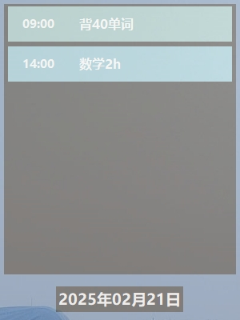
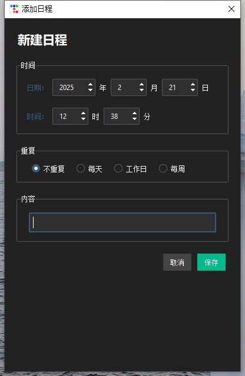

# 桌面清单
---
## 功能
- 记录每天的日程安排，精确到每分钟
- 简洁干净的ui
- 快到任务开始时间自动提醒
- 隐藏到系统托盘，不影响日常使用
- 日程永久记录，不用担心开关机和误关程序造成丢失

## 部署
### 1. 安装依赖
在运行或打包应用程序之前，请确保已安装所有依赖项。可以使用以下命令安装依赖：

```bash
pip install -r requirements.txt
```

### 2. 运行应用程序
#### 方法一：直接运行
如果不需要打包，可以直接运行应用程序：

```bash
python schedule_app.py
```

#### 方法二：打包后运行
如果需要将应用程序打包为可执行文件，可以使用以下命令：

```bash
python build.py
```

打包完成后，生成的应用程序会位于 `dist` 目录中。进入该目录并运行应用程序即可：

### 注意事项
- 如果运行过程中提示缺少依赖，手动安装一下就可以了
- 使用 `build.py` 打包时，请确保已安装打包工具（PyInstaller）。


## 使用方法
- 空白处双击左键添加日程
- 右键单击日程删除日程
- 右键空白处隐藏ui
      
## UI展示
### *桌面显示*
   
### *添加日程*
   

## 未来更新计划
- 美化ui
- 封装成应用方便使用
- 完善逻辑，现在只显示一天的日程，错误添加未来的日程无法正常删除
  
